# 叉燒 ChaShao｜性平承辦人業務管理工具

這是注定無人問津的玩具。老鳥用不到，菜鳥不會用；有資源的學校自己有管理系統，沒資源的學校承辦人也不敢把網路上撿來的東西裝進辦公電腦跑真實資料。但既然做出來了，那就發吧。

工具是繞著大學性平承辦人的日常業務做的。它能處理文書與文件管理，處理不了妖魔鬼怪、喬不攏的開會時間，也處理不了那種隨時丟一堆智缺法盲指示、還愛在人事上指手畫腳的智障法定。

從第一次知悉事件、完成通報，到正式開案、程序回報、文件交付與結案封存，承辦人每天要記的日期、要做的決定、要收的附件與待辦，都集中在同一個工作區。

這是單機桌面工具：完全離線、單人使用，資料與附件存放在使用者指定的本機工作區，沒有連線、上傳或雲端同步功能。當然，自己腦殘把工作區丟進自動雲端備份資料夾的除外。

工具負責整理流程與資料，讓承辦人更快看到下一步，也讓每次人工判斷都留下可回看的紀錄。

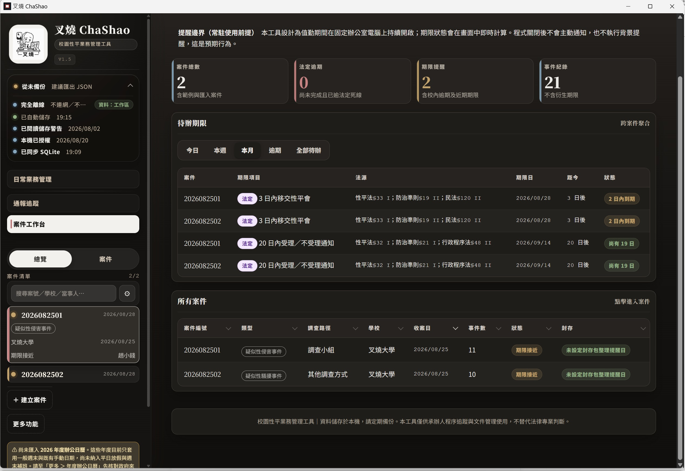

## 這套工具從哪來

設計起點是大專校院性平承辦人的實際工作。日常業務管理那一塊不確定適不適用其他學制，案件管理則依法定流程處理。具體功能：

- 追蹤已知悉但尚未正式開案的疑似事件。
- 管理多件案件的法定期限、程序節點與待補文件。
- 依案件條件追蹤校安、社政、受理、調查、通知、申復、報部與封存流程。
- 管理學期任務、性平會議、宣導活動、委員與專家資料。
- 產出校內檢核、紙本存檔、對外交付或後續交接所需的文件。

## 四大功能，從事件到結案接在一起

### 一、通報追蹤：先把還沒開案的事件記下來

有些事件已經知悉、也完成必要通報，但還在確認後續怎麼處理，尚未進入正式案件程序。通報追蹤工作區就是為這段空檔設計，以列表管理，一眼看完。

每筆通報可記錄：

- 知悉日期與時間、通報日期與來源、事件摘要。
- 校安通報日期、通報編號、承辦人。
- 是否有未滿 18 歲被害人、是否涉及疑似性侵害事件。
- 社政通報日期、時間、通報編號與相關單位資料。
- 相關人員的代號、姓名、成年狀態、性別、身分、角色與備註。
- 暫不申請調查或持續追蹤的原因、下次追蹤日期、追蹤狀態與處理結果。

容易漏填的地方會有提醒，但資料還沒補齊也能先存。知悉時間必須同時填日期與時間；社政通報欄位依被害人是否未成年、是否疑似性侵害決定要不要顯示。若未成年的只有行為人、申請人、檢舉人或證人，不會觸發被害人社政通報提醒。

通報列表預設顯示全部，可切換全部、追蹤中、已開案、已結束，也能直接檢視、編輯、結束追蹤或刪除紀錄。另附事件人員代號本，通報階段就能用代號管理人員資料。

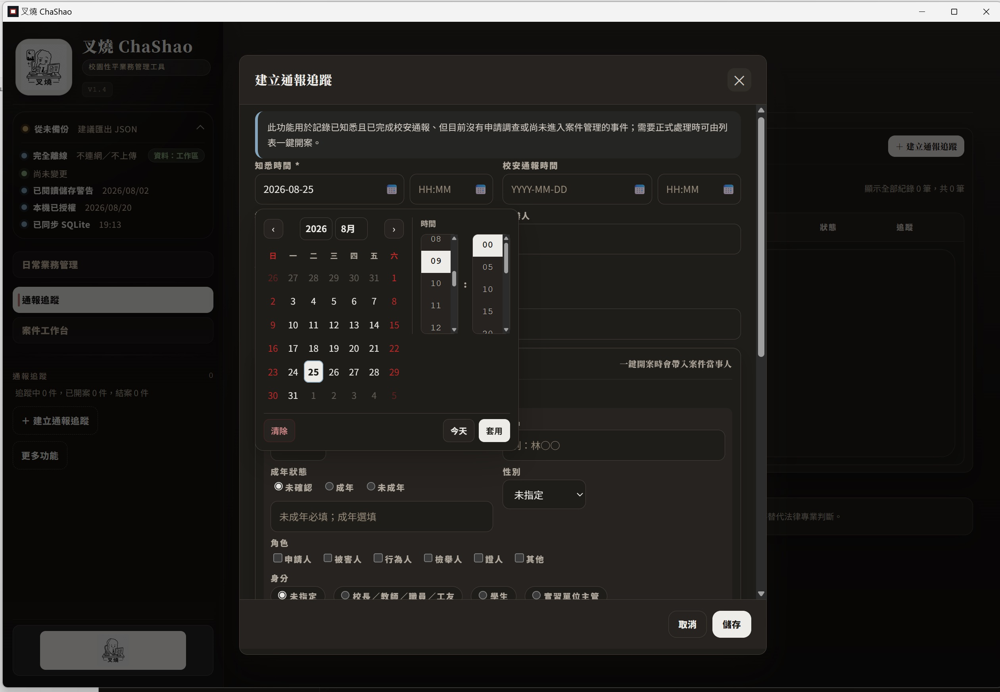

#### 確認要開案時，不必重新輸入一次

按下「一鍵開案」，原通報的知悉時間、校安與社政通報資訊、事件摘要、學校、承辦人與相關人員會直接帶進建立案件流程。原通報保留已開案狀態與正式案件的關聯，日後仍查得到事件從哪裡開始。

這項操作屬於新增案件，必須先完成設備授權；未授權時仍可建立與編輯通報紀錄。

### 二、案件管理：期限、程序、附件與決定放在同一個工作台

#### 1. 案件總覽把今天要做的事集中在一頁

案件工作台顯示案件總數、法定逾期、期限提醒與事件紀錄，待辦期限可依今日、本週、本月、逾期、全部待辦切換。清單列出案件、期限項目、法源、期限日、距今天數與狀態，點進去就能處理對應案件。

進到單一案件，頁首整理案件編號、事件類型、來源、管轄學校、承辦人、調查路徑、調查階段、案件狀態、關鍵日期與下一個期限；右側可切換期限、申復、當事人、附件、檢核與封存資訊。

叉燒設計成固定辦公電腦上長時間開著的工作台。程式關掉後不會在背景提醒，也不會寄信或推播，還是要依校內作業習慣開啟工具檢查待辦與期限。

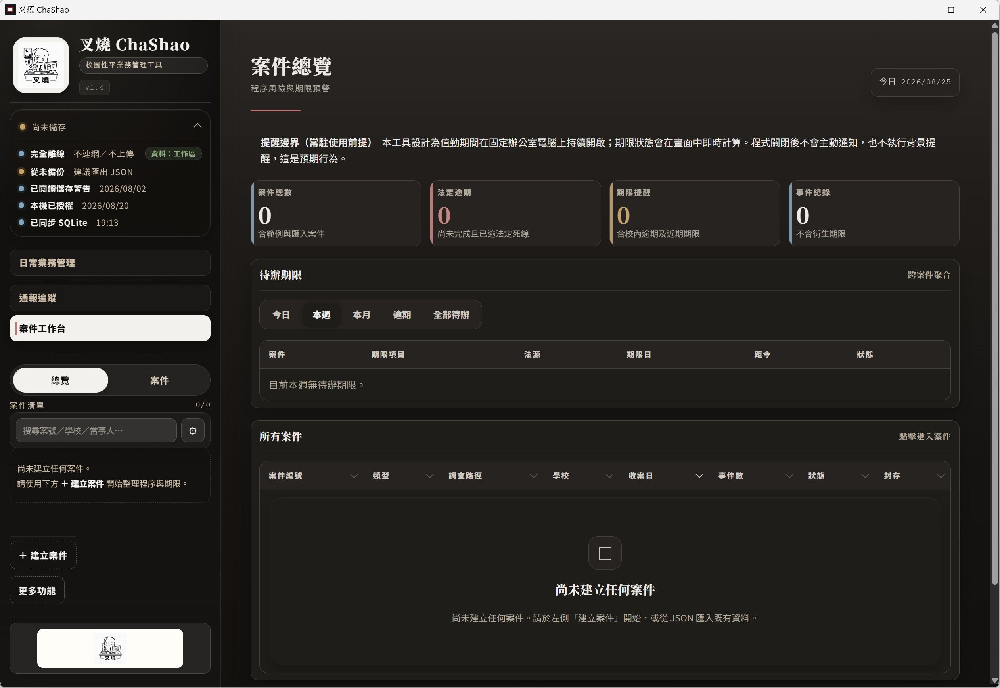

#### 2. 三步建立案件，從一開始就把資料放對位置

建立案件走三步驟精靈，減少漏填與事後補資料。

**第一步｜基本資料**

輸入案件編號、事件類型大類與細項、案件來源、管轄學校、承辦人與備註，也可記錄是否有媒體報導、是否曾向其他單位陳情或調查、是否已報警、是否已進入訴訟。勾選媒體報導時，案件來源依規則視為檢舉案。

**第二步｜關鍵日期**

知悉日期時間、校安通報狀態與日期時間、校安通報編號，以及書面申請或檢舉實際送達的收件日期時間，分開記錄。收件日是移交、受理通知等後續期限的起算點；兩者同日同時發生時也可以明確標記，不會把知悉日與收件日混成同一個預設值。

案件建立後，系統會自動建立收件（收到案件申請書）及後續程序節點。申請調查、一般檢舉、性平會檢舉與公益檢舉都必須在收件節點填寫實際收件日期並上傳案件申請書，不會因為案件來源不同就略過。

**第三步｜當事人**

以穩定代號建立申請人、檢舉人、被害人、行為人、證人或其他關係人。每位當事人可記錄姓名、成年狀態、年齡、性別、身分、複選角色與備註；代號會沿用到送達、訪談、申復、報告遮蔽與程序檢核，後續不必重設。

當事人也能標註持有身心障礙證明或有效的特殊教育學生鑑定證明。這些資料會進入程序檢核，建立調查小組名單時一併檢核成員資格，避免組成無效。

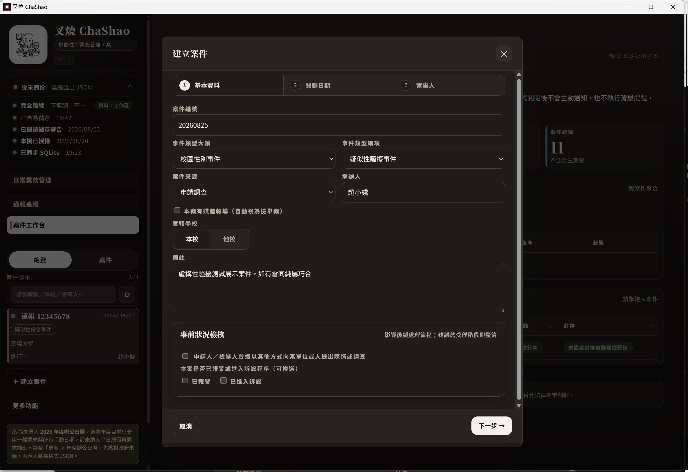

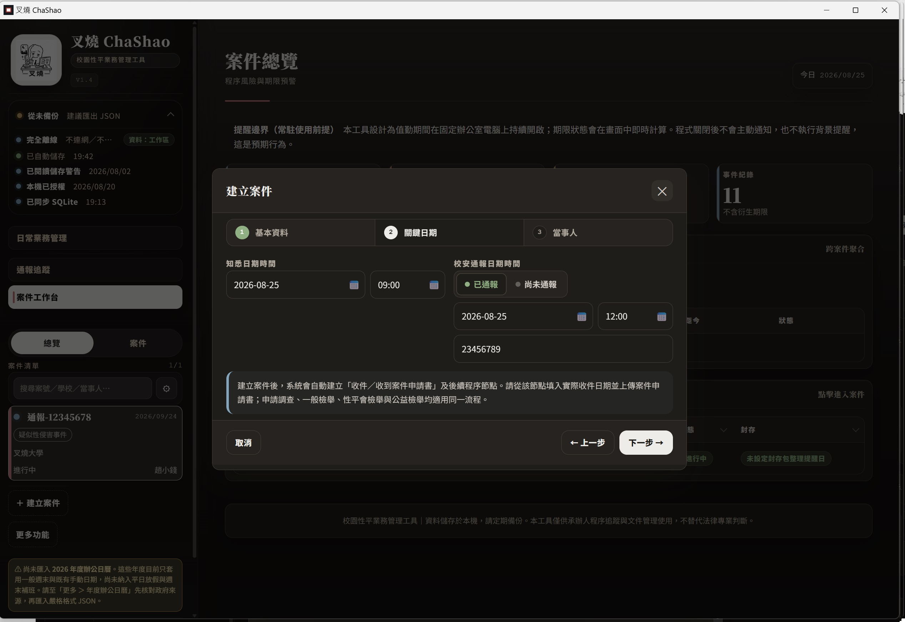

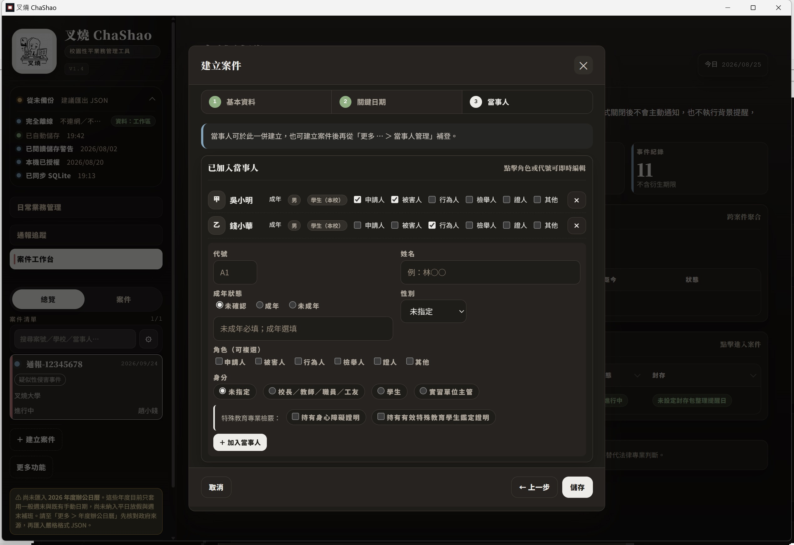

#### 3. 法定程序時間軸：每個節點都有狀態、期限與下一步

案件建立後，叉燒依目前資料建立或更新知悉、校安通報、社政通報、權益說明、保護措施、案件申請書收件、移交性平會、受理通知、調查、議處通知、申復、報部、審查、結案與封存等節點。

每個可回報節點都能記錄完成日期與時間、處理結果、內容摘要、待補事項與附件。節點完成後進入已完成區；尚未完成的留在進行中，並標示待回報、待補件、接近期限、已逾期或需要人工確認等狀態。

程序節點依承辦人回報的結果長出後續分支。例如移交性平會後，可記錄性平會決議是否受理；受理後展開受理結果通知、調查路徑及後續調查階段。性平會主動啟動的案件，在性平會決議受理後建立調查階段；教職員行為人的停聘事項另以獨立的程序提醒呈現，不會讓不需要回報的提醒長得像一般回報按鈕。

法源、期限日與剩餘天數放在節點卡片與右側期限面板，需要人工判斷的項目另外標示，讓系統算出來的日期和仍須由人確認的法律或事實判斷分開處理。

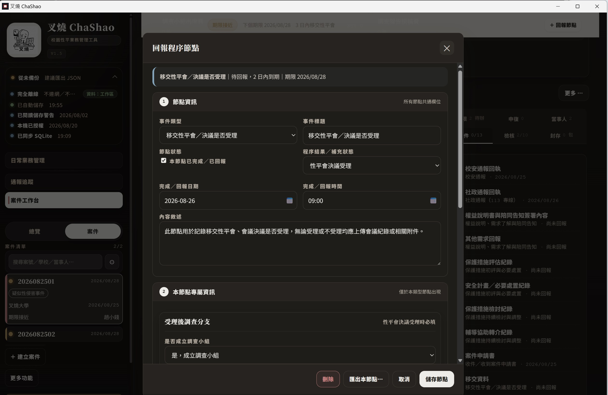

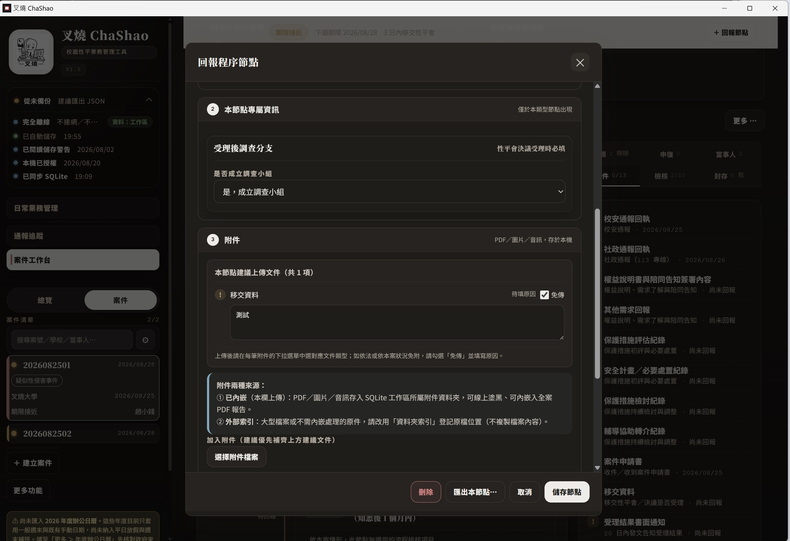

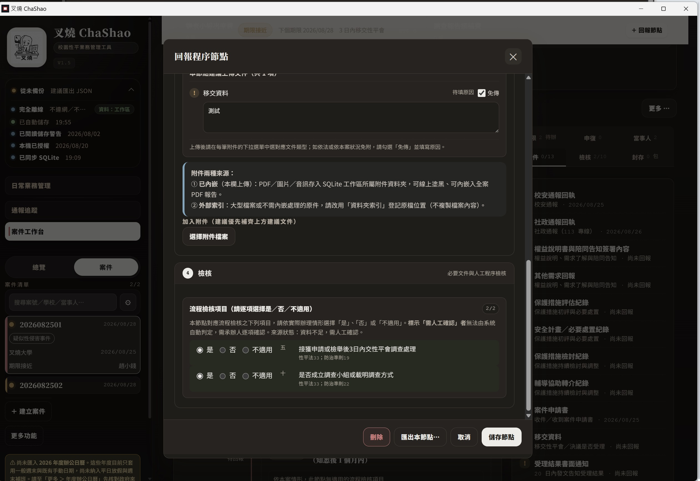

#### 4. 附件與檢核並列，少一份文件也看得見

節點可加入 PDF、圖片與音訊等附件。適合放進工作區的檔案直接內嵌儲存；大型檔案或不需複製進工作區的原件，改用資料夾索引記錄位置。每個節點會列出建議文件、已上傳文件、待補文件，以及無法附檔時的免附原因。

右側檢核區把程序條件與文件清單放在同一個畫面。必要資料不足時，不能只靠手動改狀態把案件標成完成，必須補齊資料、留下人工確認，或明確記錄免附原因。

#### 5. 調查路徑與訪談時程，讓調查工作接得上案件資料

調查路徑視窗列出簡化調查程序的適用條件與案件目前的資料，承辦人可以選擇調查小組或其他調查方式；條件不足時，改走調查小組。叉燒做的是檢核、記錄與文件整理，不替承辦人、調查小組或性平會作成法律與事實判斷。

訪談時程可從案件當事人代號帶入受訪對象，設定日期、開始時間、每人訪談分鐘數與休息時間，先預覽整體安排，再建立訪談會議節點。

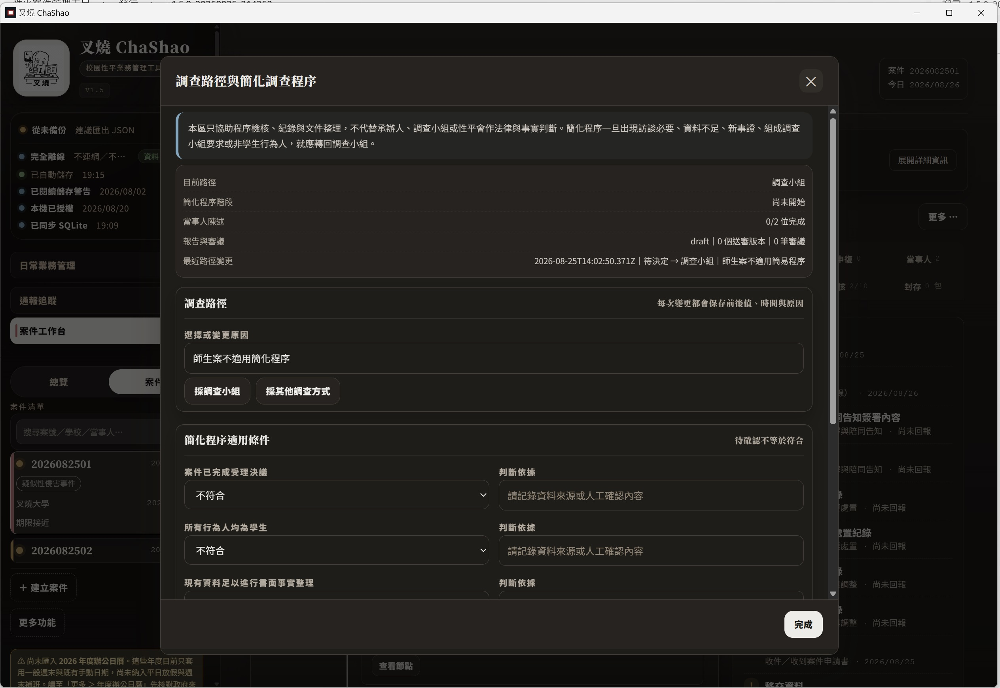

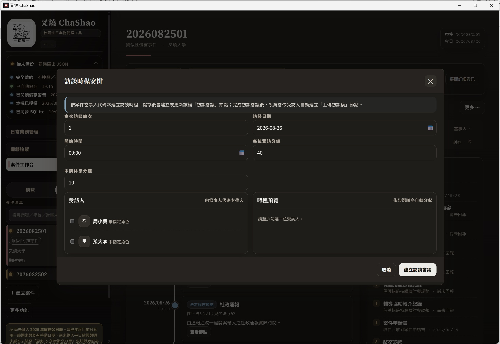

#### 6. 報告、費用、承辦歷程與封存，從處理到交付不斷線

- **案件報告**：產出對外交付或紙本存檔所需的節點摘要、時間歷程與附件資料，並依用途製作遮蔽版與未遮蔽版。正式列印、對外提供或歸檔前仍建議人工複核。
- **案件費用**：調查小組與調查報告費用可依各校規定存下單價與明細，並從委員資料帶入校內、校外人數，計算分類小計與本案實際成本。費用明細只供校內行政使用，不會自動放進對外案件報告。
- **承辦人歷程**：更換承辦人時，可記錄更換日期、原因與歷任承辦人，並把已完成節點分配給實際經手人，保留案件交接脈絡。
- **案件大事紀與完整時間軸**：大事紀補充程序以外的重要事件；完整時間軸以唯讀方式呈現案件全貌，適合交接或複核時快速回看。
- **結案與封存**：必要程序、通知、審查與申復等資料完成後才能進入結案與封存流程，並可產出整案封存資料與缺件提醒。

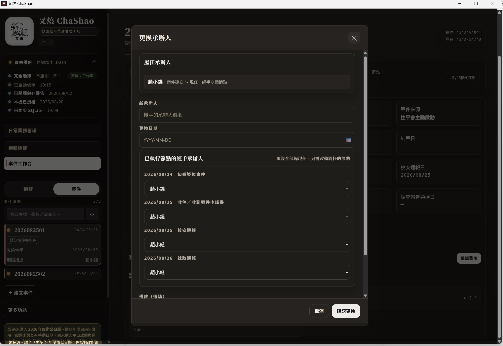

### 三、日常業務管理：把案件以外的性平工作也排進行事曆

性平承辦人的工作不只有案件。叉燒以學期與寒暑假為主軸，提供日常業務工作區：

- 建立學期、寒暑假與校務行事曆，記錄假日、活動、停課、會議與考試日期。
- 依暑假、開學初、學期前段、學期中段、期末等階段套用任務範本。
- 自訂工作項目、期限、檢核內容與附件，也能批次建立同一階段的任務。
- 以待辦、已完成或免辦（需附理由）管理任務，逐項回報檢核內容。
- 以清單、月份或階段檢視工作，用關鍵字搜尋，必要時跨學期合併查看。
- 記錄性平會議、宣導活動、教育訓練、評鑑準備與待改善事項。
- 產出學期報告與跨學期年度報告，掌握工作完成情形。

學期假日資料會併入案件期限的順延判斷；案件最急的期限則會回到日常工作視圖，案件與例行業務不必分開記在兩份清單。

### 四、其他性平業務：人員、費用、範本與報告整理成可重複使用的資源

#### 性平專家人才庫

管理校內外專家、聯絡資訊、專業領域、教育部人才庫註記、特殊教育專長與可邀請狀態。帶入案件時留下當下的資料快照；人才庫日後更新，案件端會提示來源已變更。

#### 性平委員資料庫

記錄校內性平委員身分、角色、屆期、任期、是否在任與聯絡備註。會議出席名單以當時的快照留存，事後調整委員資料不會回頭改寫已完成的案件或會議紀錄。

#### 文件範本與文稿中心

管理案件節點、日常業務、交付與年度報告所需的範本版本。正式文稿會留下產出時使用的案件資料與範本版本，送覆核前也能檢查是否還有未填標記；要對外使用時，再由承辦人依校內流程確認與輸出。

#### 學校名稱與 Logo

在本校設定填寫學校名稱、上傳或更換 Logo。設定完成後，正式輸出的文件會帶入學校名稱與 Logo，不必每次製作文件都手動整理版頭。

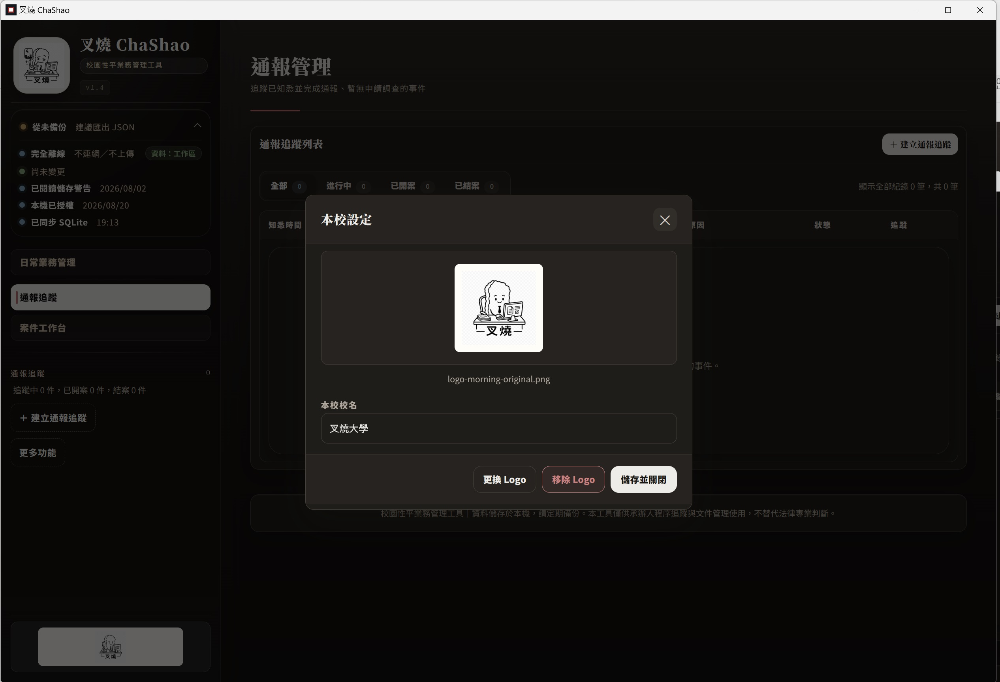

## 工具邊界

- **Windows 桌面工具**：以固定 Windows 辦公電腦與實際 A4 紙本作業為使用前提，不提供手機、平板、PWA 或瀏覽器版作為正式使用方式。
- **完全離線**：工具不主動連網、不上傳、不使用雲端同步，所有資料與附件都放在指定工作區。請避免把工作區放進 OneDrive、Google Drive、iCloud 等同步資料夾，並依校內規範管理電腦帳號、磁碟與備份媒體。
- **單機、單人**：每台電腦、每個工作區由一位承辦人使用。校內若要交接或彙整，採主動匯出或交接電腦的方式，不提供登入、即時共編或雲端同步。
- **期限提醒不是背景通知**：關掉程式後不會自動寄信、推播或在背景提醒，承辦人仍須依作業習慣開啟工作台檢查。
- **工具不是法律裁判者**：法規適用、事實認定、調查方法、性平會決議、對外發文與正式檔案保存，仍由承辦人、調查小組、性平會與學校依規定人工確認。

## 免費使用與授權方式

叉燒 ChaShao 採**符合資格後免費使用、單機一碼授權**，不公開讓所有人下載。使用對象以校園性平業務承辦人為主，取得認證碼後才能啟用新增案件功能。

- 未授權時，仍可讀取、編輯、回報、結案、匯出與備份既有案件。
- 未授權時會限制新增案件，包括通報一鍵開案、匯入新案件，以及主秘統整帶入本機沒有的新案。
- 換電腦、重灌系統或更換主機板後，可能需要重新索取設備認證碼。
- 使用試用序號時請只填虛構資料，不要輸入真實案件。試用期間建立的案件在改用正式認證碼時會完全清除，無法復原。

### 如何索取

請留下可由網路公開搜尋確認的性平業務承辦人信箱，作者會以該信箱與承辦人聯繫。申請時請不要寄送真實案件內容、當事人資料、附件、備份檔或畫面截圖。

## 如果你要找的是這些事情，叉燒幫得上忙

你不必再靠記憶猜下一個期限，不必在通報紀錄與正式案件之間重打同一批資料，也不必等到交付前才發現附件少了一份。承辦人真正需要反覆確認的事情，都放在同一個可搜尋、可回報、可追溯的工作區：

**事件有來源、日期有起算點、節點有狀態、附件有去處、決定有紀錄、交接有脈絡。**

作者：林俊逸  
聯絡方式：chashao.software@gmail.com